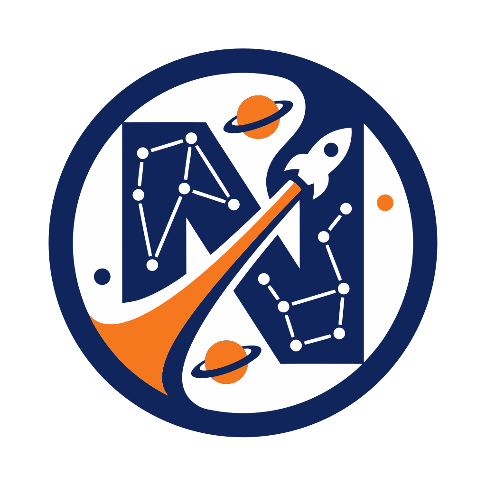

# Nebulance :dizzy:
+ An indie 3D space RPG game in development, using React, Threejs, TS, HTML and CSS.
+ You can play the game here at [Nebulance](https://nebulance.alexanderluo.com).
+ For best experience, when a new version is released, export the save and import it on another version is recommended.
+ You can always play previous versions up to v1.0.0, however playing the lastest version is always the most recommended.
+ Reading the guide at the start of a new session or migrating to a new version is recommended.
+ For the best playing experience on a specific version(e.g. v1.0.0), download a version locally if possible at [Releases](https://github.com/alexanderluo666/Nebulance/releases).
+ It is also recommended to look at the features of a new version via the [Releases](https://github.com/alexanderluo666/Nebulance/releases).

## Naming of Versions :page_facing_up:
+ No versions before v1.0.0 are recorded, for their incompleteness, you can access them via commits.
+ First version is v1.0.0.
+ Each major version(refers to first digit) contains better features than previous one.
+ A subversion or a subrelease is indicated by the second digit, it contains minor features and upgrades.
+ A bug-fix version is indicated by the third digit, it contains bug fixes, and might also contain 'alpha', 'beta' versions for minor but unstable or non-game related-content(README.md updates), which are not limited to numbers.

## Features :star:
+ Choose multiple ships and fly around the beautiful man-made galaxy as a plane, explore and have fun!
+ Whether you like gathering resources or fighting and fleeing, this game is perfect for you!
+ Unlock different features and tools via purchasing by N$, Nebulance Dollars.
+ Has backend and frontend, runs by and combined to get **npm run stack**:
```bash
npx wrangler pages dev dist --d1=nebulance_db
npm run dev
```


## Purpose And Vision :eyes:
+ Name inspiration taken from Nebula(Star clouds) + Balance &#8594; Nebu-lance.
+ To build a game from scratch while learning React, Threejs, TS, HTML and CSS.
+ Influenced and inspired by notable game titles: EVE Online, Star Citizen and No Man's Sky.
+ Using low-poly stylized models, such as ones from [Poly Pizza](https://poly.pizza/).
+ First properly made and maintained 3D game of mine.
+ Focuses on storytelling, gameplay and game vibe.
+ Naming for Nebulaster comes from Nebula and ster as a suffix.
+ Naming for Ghostrider comes from Ghost and rider(not to be affiliated with movies).
+ Naming for Haloist comes from Halo and ist.
  
## Ship Controls For Basic Ship :keyboard:
+ W for forward steer
+ S for backward steer
+ A for left steer
+ D for right steer
+ Z for left/counter-clockwise roll
+ C for right/clockwise roll
+ &#8592; for left pivot turn
+ &#8594; for right pivot turn
+ &#8593; for up steer
+ &#8595; for down steer
+ Shift for boost
+ Space for laser beam shoot
+ E for dock and inventory
+ ESC for quit

## Credit for resources :open_file_folder:
+ Spaceship by Quaternius used for [SpaceShip1](https://poly.pizza/m/uCeLfsdmNP)
+ Asteroid by Poly by Google [CC-BY](https://creativecommons.org/licenses/by/3.0/) via [Poly Pizza](https://poly.pizza/m/enaIlQWET9a)
+ International Space Station by Poly by Google [CC-BY](https://creativecommons.org/licenses/by/3.0/) via [Poly Pizza](https://poly.pizza/m/d3Fq5H6ne8E)
+ Spaceship by Quaternius used for [SpaceShip2](https://poly.pizza/m/u105mYHLHU)
+ Spaceship by Liz Reddington used for SpaceShip3 [CC-BY](https://creativecommons.org/licenses/by/3.0/) via [Poly Pizza](https://poly.pizza/m/5nWeu4IQXVX)
+ dune spaceship by Tom De Wispelaere used for SpaceShip4 [CC-BY](https://creativecommons.org/licenses/by/3.0/) via [Poly Pizza](https://poly.pizza/m/fo5Gj1JPq-v)
+ 1 by Eric Finn used for SpaceShip5 [CC-BY](https://creativecommons.org/licenses/by/3.0/) via [Poly Pizza](https://poly.pizza/m/05X3xYCrpya)
+ SVG icon by [SVGREPO](https://www.svgrepo.com/svg/285247/spacecraft-spaceship)
+ Audio from [Pixabay Music](https://pixabay.com/music/)


